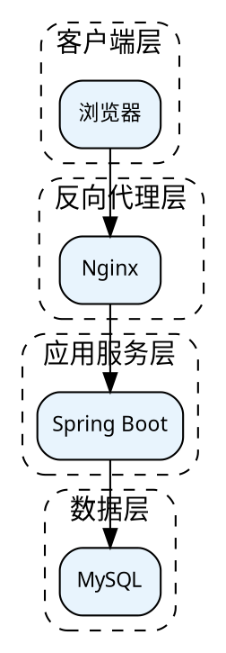
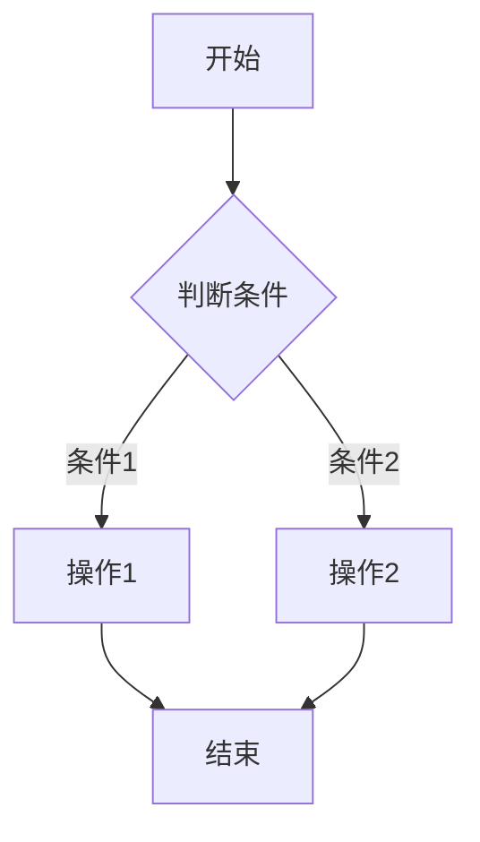

# 软著设计说明书生成

生成包含完整图表的软著申请材料：申请表(.doc)、合并源代码(.docx)、软件设计说明书(.docx)。

## 核心原则

**图表是设计说明书的灵魂。** 没有流程图、架构图、时序图的设计说明书不符合软著审核要求。Mermaid 画业务流程，Graphviz 画系统架构。

## 前置依赖

- Python 3.10+，`pip install python-docx`
- Node.js，`npm install -g @mermaid-js/mermaid-cli`
- Graphviz：`winget install Graphviz.Graphviz`，或 `choco install graphviz`
- 验证：`mmdc --version` 和 `dot -V`

## 工作流

### 1. 读模板

读取已有的模板 .doc 文件，理解申请表的表格结构（26行2列，字段名+字段值）。模板通常位于 `模板/` 目录下。

```python
from docx import Document
doc = Document("模板/xxx.doc")
for i, row in enumerate(doc.tables[0].rows):
    print(f"Row {i}: {row.cells[0].text} -> {row.cells[1].text}")
```

### 2. 读代码（精读）

从项目中提取以下信息，形成业务理解：

| 信息来源 | 提取内容 |
|---------|---------|
| `pom.xml` / `package.json` | 技术栈、版本号 |
| Controller 文件 | API 端点、业务模块划分 |
| Service 文件 | 核心业务逻辑、算法 |
| Domain/Model 文件 | 数据实体、字段定义 |
| SQL 文件 | 数据库表结构 |
| 路由文件 (`router/`) | 前端页面结构 |
| 配置文件 (`application.yml`) | 端口、中间件配置 |
| 通信模块 (Netty/WebSocket) | 协议、交易码、时序 |

### 3. 生成图表

按以下清单生成 10 张图，全部输出为 PNG：

| 图名 | 工具 | 内容 |
|------|------|------|
| 01_system_architecture | Graphviz | 6层架构：客户端→反向代理→应用→业务→数据→边缘设备 |
| 02_module_decomposition | Graphviz | 前端/后端/通信三大模块及其子模块 |
| 03_login_flow | Mermaid | 用户登录完整流程（含验证码、锁定逻辑） |
| 04_hall_management | Mermaid | 核心业务模块1的增删改查流程 |
| 05_terminal_management | Mermaid | 核心业务模块2的完整操作流程 |
| 06_resource_publish | Mermaid | 资源上传/下发流程 |
| 07_queue_management | Mermaid | 设备通信/数据上报流程 |
| 08_netty_sequence | Mermaid | 关键组件间的通信时序图 |
| 09_database_er | Mermaid | 数据库 ER 关系图 |
| 10_data_flow | Mermaid | 数据流图：输入→处理→存储→输出 |

**Graphviz 模板（系统架构图）：**



**Mermaid 模板（流程图）：**



**渲染命令：**

```bash
# Mermaid → PNG
mmdc -i diagram.mmd -o diagram.png -b white -w 1200

# Graphviz → PNG
dot -Tpng -Gdpi=150 diagram.dot -o diagram.png
```

### 4. 生成三个文档

#### 4.1 申请表 (.doc)

用 python-docx 创建 Word 表格，严格按模板的 26 行结构：

```python
table = doc.add_table(rows=26, cols=2)
table.style = 'Table Grid'
fields = [
    ("著作权人姓名或名称（必填）", "实际值"),
    ("软件名称（必填）", "XXX系统"),
    # ... 共26个字段
]
for i, (label, value) in enumerate(fields):
    table.cell(i, 0).paragraphs[0].add_run(label)
    table.cell(i, 1).paragraphs[0].add_run(value)
```

字段填写规则：
- 软件名称必须以"软件/系统/平台"结尾
- 版本号格式 `VX.X` 或 `VX.X.X`
- 源程序量 = 全部源码总行数（含空行）
- 主要功能 500-1300 字
- 技术特点 ≤100 字
- 开发/运行硬件环境 ≤50 字

#### 4.2 合并源代码 (.docx)

将前30页和后30页合并为一个文件（共60页）：

```python
# 读取选中的源文件，去除纯空行
for file in selected_files:
    lines = [l for l in open(file) if l.strip()]
    all_lines.append(f"// File: {file}")
    all_lines.extend(lines)

# 每50行一页
pages = [all_lines[i:i+50] for i in range(0, len(all_lines), 50)]
selected = pages[:30] + pages[-30:]  # 前30+后30
```

页眉格式：`软件名称 版本号`（左对齐）

#### 4.3 软件设计说明书 (.docx)

章节结构（按软著审核要求）：

| 章节 | 内容 | 嵌入图 |
|------|------|-------|
| 一、引言 | 编写目的、项目背景、术语定义 | 无 |
| 二、总体设计 | 系统架构、技术栈、模块划分 | 架构图、模块图 |
| 三、接口设计 | REST API、WebSocket、Netty TCP | 协议表格 |
| 四、模块设计 | 每个模块：功能说明+流程图+函数表+算法 | 流程图×5 |
| 五、运行设计 | 运行流程、数据流、通信时序 | 登录流程图、数据流图、时序图 |
| 六、出错处理设计 | 接口异常、通信异常、数据库异常 | 无 |
| 七、数据库设计 | ER图、核心表结构 | ER图 |

每个模块设计的写法：

```markdown
### 4.X 模块名

#### 4.X.1 功能说明
（段落描述模块用途、管理的实体、支持的操作）

#### 4.X.2 处理流程图
（插入 Mermaid 流程图 PNG）

#### 4.X.3 关键函数
（表格：函数名 | 所属类 | 功能说明）

#### 4.X.4 算法说明
（描述核心算法逻辑，如唯一性校验、状态检测、数据解析）
```

### 5. 组装输出

一个主脚本统一调用：

```python
# build_all.py
generate_application_form()  # → .doc
generate_merged_code()       # → .docx (60页)
generate_design_spec()       # → .docx (含图)
```

输出到同一目录，文件命名：
- `{软件全称}.doc`
- `{软件全称}--源代码.docx`
- `{软件全称}--软件设计说明书.docx`

## 常见错误

| 错误 | 正确做法 |
|------|---------|
| 设计说明书不放图 | 必须嵌入架构图、流程图、时序图、ER图 |
| 源代码分成两个文件 | 合并为一个 .docx，取前30+后30页 |
| 申请表用 .txt | 申请表是 .doc 表格格式 |
| 图用文字描述代替 | 必须渲染为 PNG 嵌入 Word |
| 流程图用 AI 编造 | 必须从真实代码逻辑推导 |
| 函数表不写所属类 | 每个函数必须标明 Controller/Service 类名 |
| Mermaid 中文乱码 | Graphviz 设 `fontname="Microsoft YaHei"` |

## 输出校验清单

- [ ] 申请表 .doc 存在且表格26行完整
- [ ] 源代码 .docx 为60页，页眉含软件名+版本号
- [ ] 设计说明书 .docx 包含7个一级章节
- [ ] 设计说明书嵌入 ≥8 张图（架构、模块、5个流程、时序、ER、数据流）
- [ ] 每个模块有功能说明、流程图、函数表、算法说明
- [ ] 软件名称和版本号三个文档一致
- [ ] 所有图表从真实代码推导，非 AI 编造
